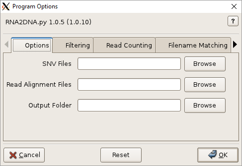
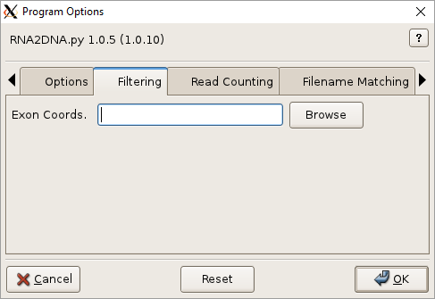

# RNA2DNA Usage

## Synopsis

### Graphical User Interface:

    RNA2DNA

### Command-line:

    RNA2DNA [options]

## Description

## Graphical User Interface

Click the help icon (question mark) at the top right of the GUI and
then an input field for help. Multiple files can be selected in the
file-browser using Ctrl-Click or Shift-Click. Fields can be reset to
their default values using the Reset button. Click OK to execute
RNA2DNA.

Additional GUI option tabs are documented below.

## Options

SNVs, -s SNVS, --snvs=SNVS

> Single-nucleotide-polymophisms (SNVs). Tabular and VCF format SNVs
> are supported. Supported tabular formats include `txt`, `tsv`, `csv`, `xlsx`,
> `xls`. Text files (`txt`) must have four whitespace separated columns
> representing the chromosome (CHROM), locus (POS), wild-type allele
> nucleotide (REF), and SNV nucleotide (ALT). Other tabular formats
> must provide CHROM, POS, REF, ALT headings. Extra values in tabular
> or VCF format files are mapped to the output. Required.

Read Alignment Files, -r ALIGNMENTS, --readalignments=ALIGNMENTS

> Read alignments files in indexed BAM format, with extension
> `.bam`. BAM index with extension `.bam.bai` must be located in the
> same directory. Required.

Output Folder, -o OUTPUT, --output=OUTPUT

> Output directory. Will be created if necessary. Files inside this directory will be overwritten by program output. Required. 

--version

>Show program's version number and exit. 

-h, --help

>Show program help and exit.

### Filtering

Exon Coords., -e EXONCOORDS, --exoncoords=EXONCOORDS

> Exon coordinates to filter out non-coding SNVs. See (Annotation Files)[Annotation.md] for format and download information. Optional.

### Read Counting

Min. Reads, -m MINREADS, --minreads=MINREADS

> Minimum number of good reads at each SNV locus per alignment file. Default=10.   

Filter Alignments, -f, --alignmentfilter

> (Turn off) alignment filtering by length, edits, etc.

Unique Reads, -U, --uniquereads   

> Consider only distinct reads.  

Threads/BAm, -t TPB, --threadsperbam=TPB                   

> Worker threads per alignment file. Indicate no threading with 0. Default=1.

Quiet, -q, --quiet

> Do not show readCounts progress.

## See Also

[RNA2DNA Home](..), [Input Files](InputFiles.md), [Output Files](OutputFiles.md), [Annotation Files](AnnotationFiles.md)

