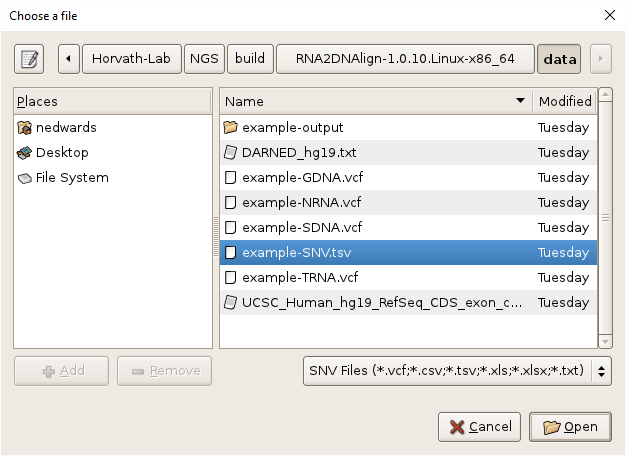
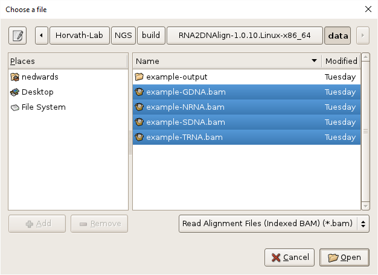
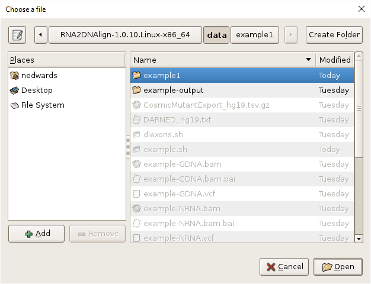
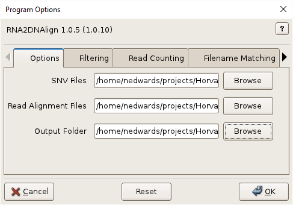
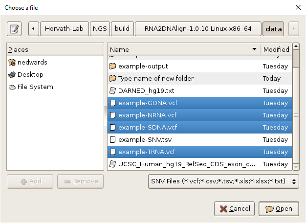
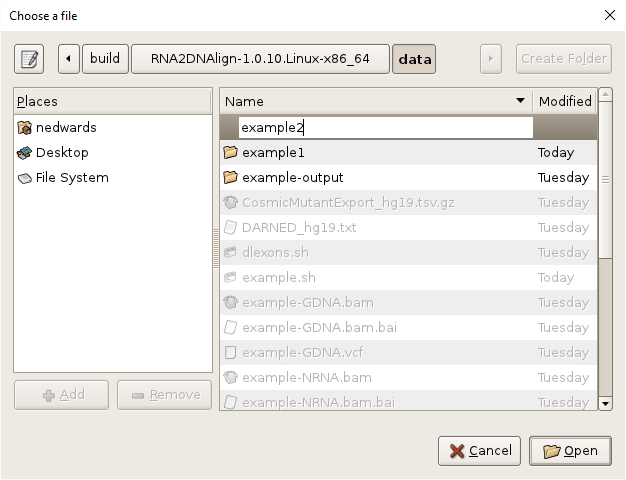
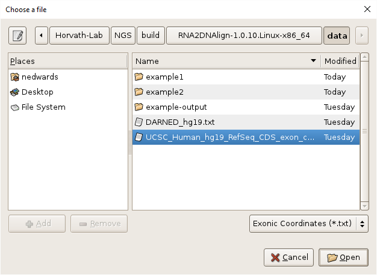

# RNA2DNAlign Examples

## Command-line:

### Example 1: BAM files and single SNV file in TSV format.

    cd RNA2DNAlign/data
    ../bin/RNA2DNAlign -r "example-*.bam" -s "example-SNV.tsv" -o example1

### Example 2: BAM and VCF files for each dataset, exonic SNV filtering, and DARNED and COSMIC annotations using the supplied annotation files.

    cd RNA2DNAlign/data
    ../bin/RNA2DNAlign -r "example-GDNA.bam example-NRNA.bam example-SDNA.bam example-TRNA.bam" -s "example-*.vcf" -o example2 -e UCSC_Human_hg19_RefSeq_CDS_exon_coordinates.txt -d DARNED_hg19.txt -c CosmicMutantExport_hg19.tsv.gz

Result files corresponding to this analysis are available in the `RNA2DNAlign/data` directory in the `example-output` directory. 

Example output files: 
* [Events_LOH.tsv](../data/example-output/Events_LOH.tsv)
* [Events_RNAed.tsv](../data/example-output/Events_RNAed.tsv)
* [Events_SOM.tsv](../data/example-output/Events_SOM.tsv)
* [Events_T-RNAed.tsv](../data/example-output/Events_T-RNAed.tsv)
* [Events_T-VSE.tsv](../data/example-output/Events_T-VSE.tsv)
* [Events_T-VSL.tsv](../data/example-output/Events_T-VSL.tsv)
* [Events_VSE.tsv](../data/example-output/Events_VSE.tsv)
* [Events_VSL.tsv](../data/example-output/Events_VSL.tsv)
* [readCounts.tsv](../data/example-output/readCounts.tsv)
* [summary_result.txt](../data/example-output/summary_result.txt)

### Example 3: BAM and VCF files for each dataset, exonic SNV filtering, and minimum reads per loci in each dataset of 3. 

    cd RNA2DNAlign/data
    ../bin/RNA2DNAlign -r "example-*.bam" -s "example-*.vcf" -o example3 -e UCSC_Human_hg19_RefSeq_CDS_exon_coordinates.txt -m 3

## Graphical User Interface

### Example 1: BAM files and single SNV file in TSV format.

1. Select the SNV file by clicking on the `Browse` button, navigating to `RNA2DNAlign/data`, selecting `example-SNV.tsv`, and clicking `OK`.

2. Select the BAM files by clicking on the `Browse` button, navigating to `RNA2DNAlign/data`, selecting all the BAM files, using shift-click or control-click as needed, and clicking `OK`.

3. Specify the output directory by clicking on the `Browse` button, navigating to `RNA2DNAlign/data`, clicking `Create Folder`, entering "example1", and clicking `Open`.

4. Click `OK` to execute the program.

### Example 2: BAM and VCF files for each dataset, exonic SNV filtering, and DARNED and COSMIC annotations using the supplied annotation files.

1. Select the VCF files by clicking on the `Browse` button, navigating to `RNA2DNAlign/data`, selecting all the VCF files, using shift-click or control-click as needed, and clicking `OK`.

2. Select the BAM files by clicking on the `Browse` button, navigating to `RNA2DNAlign/data`, selecting all the BAM files, using shift-click or control-click as needed, and clicking `OK`.

3. Specify the output directory by clicking on the `Browse` button, navigating to `RNA2DNAlign/data`, clicking `Create Folder`, entering "example2" and clicking `Open`.

4. Specify exonic SNV filtering by selecting the `Filtering` tab, clicking on the `Browse` button, navigating to `RNA2DNAlign/data`, selecting "UCSC_Human_hg19_RefSeq_CDS_exon_coordinates.txt", and clicking `OK`.

5. Specify DARNED and COSMIC annotation of SNP events on the `SNV Annotation` tab, selecting the files `DARNED_hg19.txt` and `CosmicMutantExport_hg19.tsv.gz`. 

6. Click `OK` to execute the program.

Result files corresponding to this analysis are available in the `RNA2DNAlign/data` directory in the `example-output` directory. 

Example output files: 
* [Events_LOH.tsv](../data/example-output/Events_LOH.tsv)
* [Events_RNAed.tsv](../data/example-output/Events_RNAed.tsv)
* [Events_SOM.tsv](../data/example-output/Events_SOM.tsv)
* [Events_T-RNAed.tsv](../data/example-output/Events_T-RNAed.tsv)
* [Events_T-VSE.tsv](../data/example-output/Events_T-VSE.tsv)
* [Events_T-VSL.tsv](../data/example-output/Events_T-VSL.tsv)
* [Events_VSE.tsv](../data/example-output/Events_VSE.tsv)
* [Events_VSL.tsv](../data/example-output/Events_VSL.tsv)
* [readCounts.tsv](../data/example-output/readCounts.tsv)
* [summary_result.txt](../data/example-output/summary_result.txt)

## See Also

[RNA2DNAlign Home](..), [Input Files](InputFiles.md), [Output Files](OutputFiles.md), [Annotation Files](AnnotationFiles.md)

