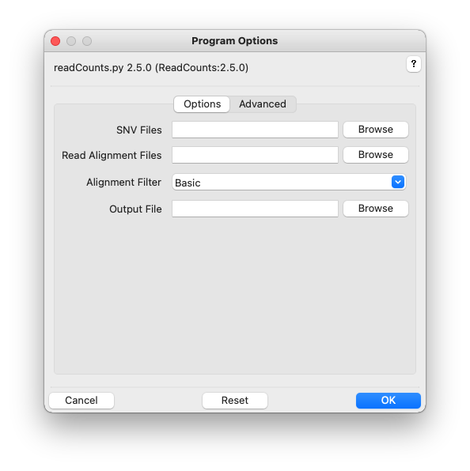
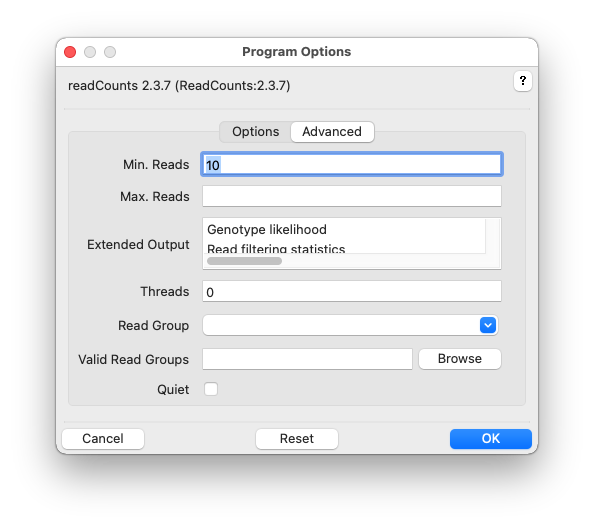

# ReadCounts Usage

## Synopsis

### Graphical User Interface:

    readCounts

### Command-line:

    readCounts -r <bam_file> -s <snv_list_file> [options]

## Description

ReadCounts tabulates the number of reads providing evidence for variant and reference nucleotides at specific genomic loci and applies statistical tests to recognize allelic read-counts consistent with homozygous and heterozygous loci.

## Graphical User Interface

Click the help icon (question mark) at the top right of the GUI and
then an input field label for help. Multiple files can be selected in the
file-chooser using Ctrl-Click or Shift-Click. Fields can be reset to
their default values using the Reset button. Click OK to execute
readCounts.

Additional GUI option tabs are documented below.

## Options

SNVs, -s SNVS, --snvs=SNVS

> Single-nucleotide-variants (SNVs). Tabular and VCF format SNVs
> are supported. Multiple SNV files can be selected from the chooser in the graphical user interface, and on the command-line specified inside quotes, separated
> by spaces, or by using file globbing. See [Input
> Files](InputFiles.md) for more information. Required.

Read Alignment Files, -r ALIGNMENTS, --readalignments=ALIGNMENTS

> Read alignments files in indexed BAM format, with extension
> `.bam`. BAM index with extension `.bam.bai` must be located in the
> same directory. Multiple BAM files can be selected from the chooser in the graphical user interface, and on the command-line specified inside quotes,
> separated by spaces, or by using file globbing. See [Input
> Files](InputFiles.md) for more information. Required.

Alignment Filter, -f FILTER, --alignmentfilter=FILTER

> Alignment filtering strategy. See [Read Filtering](Filtering.md) for more details. Default: Basic.

Output Folder, -o OUTPUT, --output=OUTPUT

> Output file. Will be created if necessary. See [Output Files](OutputFiles.md) for more information on output files. Optional. 

--version

>Show version number and exit. 

-h, --help

>Show command-help and exit.

### Advanced

Min. Reads, -m MINREADS, --minreads=MINREADS

> Minimum number of good reads at each SNV locus per alignment file. Default=10.   

Max. Reads, -m MAXREADS, --maxreads=MAXREADS

> Scale read counts at high-coverage loci to ensure at
                        most this many good reads at SNV locus per alignment
                        file. Values greater than 1 indicate absolute read
                        counts, otherwise the value indicates the coverage
                        distribution percentile. Default=No maximum.

Extended Output, -E, --extended=EXTENDED

> Generate extended output, one or more comma-separated values: Genotype likelihood, Read filtering statistics. Default: No extended ouptut.

Read Group, -G READGROUP, --readgroup=READGROUP

> Additional read grouping based on read name/identifier strings or BAM-file RG. See [Read Grouping](Grouping.md) for more details. Default: None, group reads by BAM-file only.

Valid Read Groups, -b BARCODES, --barcode_acceptlist BARCODES

> File of white-space separated, acceptable read group values (barcode accept list). Overrides value, if any, specified by Read Group. Use None to remove a default accept list.

Threads/BAM, -t TPB, --threadsperbam=TPB                   

> Each worker thread is allocated one or more BAM files. Indicate no threading with 0. Default: 0.

Quiet, -q, --quiet

> Do not show readCounts progress.

