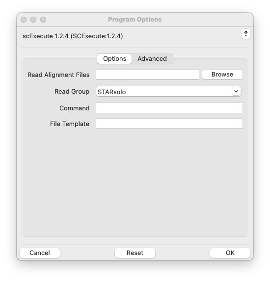
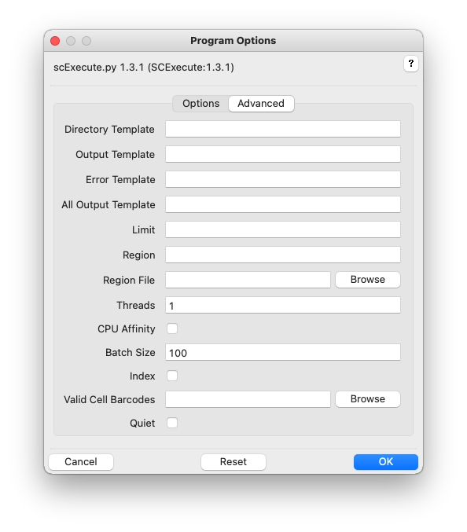

# SCExecute Usage

## Synopsis

### Graphical User Interface:

    scExecute

### Command-line:

    scExecute -r <bam_file> [options]

## Description

SCExecute generates cell-barcode specific BAM files from aligned, aggregate single-cell sequencing data, executing a user-provided command on each barcode-stratified BAM file. Unlike other tools, SCExecute generates cell-barcode specific BAM files in batches to avoid file-system and memory constraints, and manages the execution of the user-provided commands on multiple processes to improve throughput. Cell-barcodes can be extracted from read-names or BAM-file tags populated by a variety of tools, included STARsolo and UMI-tools, and can be restricted to barcodes of interest. Implemented in Python3 using the PySAM package and distributed for Linux, MacOS, and Python environments, SCExecute builds on other NGS tools from the Horvath lab, including SCReadCounts.

## Graphical User Interface

Click the help icon (question mark) at the top right of the GUI and
then an input field label for help. Multiple files can be selected in the
file-chooser using Ctrl-Click or Shift-Click. Fields can be reset to
their default values using the Reset button. Click OK to execute
scExecute.

Additional GUI option tabs are documented below.

## Options

Read Alignment Files, -r ALIGNMENTS, --readalignments=ALIGNMENTS

> Read alignments files in indexed BAM format, with extension
> `.bam`. BAM index with extension `.bam.bai` must be located in the
> same directory. Multiple BAM files can be selected from the chooser in the graphical user interface, and on the command-line specified inside quotes,
> separated by spaces, or by using file globbing. See [Input
> Files](InputFiles.md) for more information. Required.

Read Group, -G READGROUP, --readgroup=READGROUP

>  Read group / barcode extraction strategy. Options: STARsolo (Cell barcodes added by STARsolo in CB tag of aligned read - reads without a CB tag or with CB tag not in the accept list (default: file "barcodes.tsv" in the current directory) dropped), UMI-tools (Cell barcodes from read name added by umi_tools). See [Read Groups](Grouping.md). Default: STARsolo.

Command, -C COMMAND, --command=COMMAND

> Command to execute for each read-group specific BAM file. The BAM filename replaces {} in the command or is placed at the end of the command if no {} is present.  Required.

--version

>Show version number and exit. 

-h, --help

>Show command-help and exit.

### Advanced

Threads, -t T, --threads=T

> Number of instances of COMMAND to run at once. Default: 1.

Batch Size, -B B, --batch=B

> Number of BAM files to extract with each pass of the input reads. Default: 10.

Indx, -i, --index

> Index read-group specific BAM file before executing command. Default: False.

Valid Read Groups, -b BARCODES, --barcode_acceptlist BARCODES

> File of white-space separated, acceptable read group values (barcode accept list). Overrides value, if any, specified by Read Group. Use None to remove a default accept list.

Quiet, -q, --quiet

> Do not show scExecute progress.

## See Also

[SCExecute Home](..), [Input Files](InputFiles.md), [Read Groups](Grouping.md), [Examples](Examples.md)
