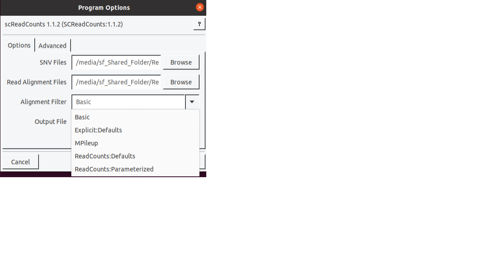
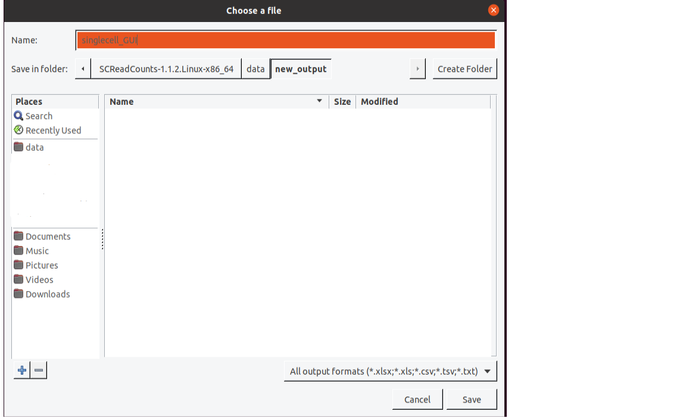
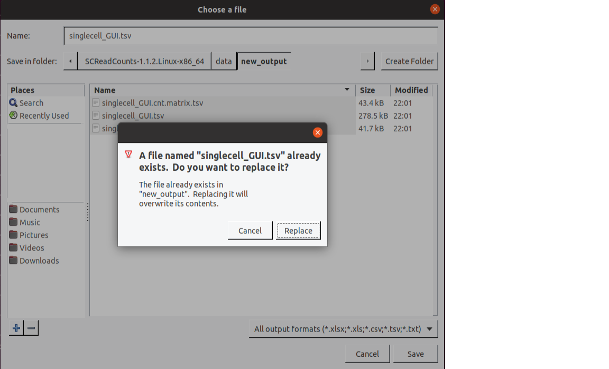

# SCReadCounts Examples

* [Command-line](https://github.com/HorvathLab/NGS/blob/master/SCReadCounts/docs/Examples.md#command-line)
* [Graphical User Interface](https://github.com/HorvathLab/NGS/blob/master/SCReadCounts/docs/Examples.md#graphical-user-interface)

## Command-line:

### Example: BAM files and single SNV file in TSV format.

    sh singlecell.sh

The above script runs SCReadCounts using the inputs from `SCReadCounts/data` (snv file = `singlecell_222_5_chr17.txt`, bam = `singlecell_chr17.bam`, output prefix = `singlecell-output.tsv`). Result files corresponding to this analysis are available [here](../data/output)

Example output files: 
* [Counts](../data/output/singlecell-output.tsv)
* [Count matrix (Ref;Var)](../data/output/singlecell-output.cnt.matrix.tsv)
* [VAF matrix with minR=3](../data/output/singlecell-output.vaf-m3.matrix.tsv)
* [VAF matrix with minR=3](../data/output/singlecell-output.vaf-m5.matrix.tsv)

## Graphical User Interface

### Example 1: BAM files and single SNV file in `txt` format with default minR value (5).

1. Select the SNV file by clicking on the `Browse` button, navigating to `SCReadCounts/data`, selecting `singlecell_222_5_chr17.txt`, and clicking `OK`.

2. Select the BAM files by clicking on the `Browse` button, navigating to `SCReadCounts/data`, selecting `singlecell_chr17.bam` (multiple BAM files can be selected using shift-click or control-click as needed), and clicking `OK`.

3. Specify the [filtering option](https://github.com/HorvathLab/NGS/tree/master/ReadCounts/docs/filtering.md) by clicking on the `🠋` button.

   

4. Specify the output directory by clicking on the `Browse` button, navigating to `SCReadCounts/data`, clicking `Create Folder`, entering "new_output", entering the name as `singlecell_GUI.tsv` and clicking `Save`.

   

SCReadCounts will create the following files:
* Counts(singlecell_GUI.tsv)
* Count matrix (Ref;Var)(singlecell_GUI.cnt.matrix.tsv)
* VAF matrix with minR=5 (singlecell_GUI.vaf-m5.matrix.tsv)

5. Click `OK` to execute the program.

### Example 2: Re-running SCReadCounts with different minR value (10).

1. Select the SNV file by clicking on the `Browse` button, navigating to `SCReadCounts/data`, selecting `singlecell_222_5_chr17.txt`, and clicking `OK`.

2. Select the BAM files by clicking on the `Browse` button, navigating to `SCReadCounts/data`, selecting `singlecell_chr17.bam` (multiple BAM files can be selected using shift-click or control-click as needed), and clicking `OK`.

3. Specify the [filtering option](https://github.com/HorvathLab/NGS/tree/master/ReadCounts/docs/filtering.md) by clicking on the `🠋` button.

4. Specify the output directory by clicking on the `Browse` button, navigating to `SCReadCounts/data`, clicking `Create Folder`, entering "new_output", entering the name as `singlecell_GUI.tsv` and clicking `Save`. You will be prompted with a message `A file named "singlecell_GUI.tsv" already exists. Do you want to replace it?`. Click on the `Replace` button.

   

5. Click `OK` to execute the program.

Since the output files: `singlecell_GUI.tsv and singlecell_GUI.cnt.matrix.tsv` already exists (it doesn't change with respect to the "advanced" option of minR), only one new file will be created i.e. VAF with minR of 10 (singlecell_GUI.vaf-m10.matrix.tsv)

## See Also

[SCReadCounts Home](..), [Input Files](InputFiles.md), [Output Files](OutputFiles.md), [Annotation Files](AnnotationFiles.md)

