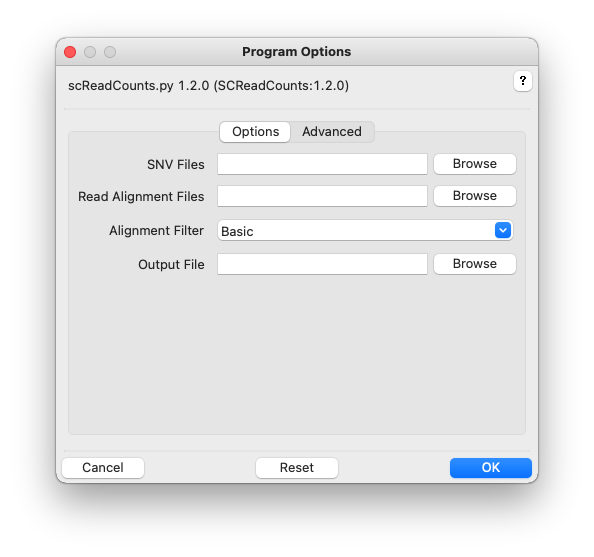
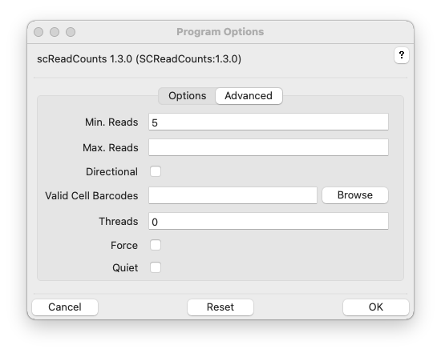

# SCReadCounts Usage

## Synopsis

### Graphical User Interface:

    scReadCounts

### Command-line:

    scReadCounts -r <bam_file> -s <snv_list_file> -o <output_file> [options]

## Description

Currently, SCReadCounts has two programs. The program readCounts requires two input files: a pooled single cell alignment and a list of genomic positions of interest. readCounts utilizes the barcode information from the pooled single cell alignments and outputs the variant and reference read counts (nvar and nref, respectively), for each barcode (cell) present in the `barcodes.tsv` file, in a tab separated text file. This file is then used as an input for the second program - readCountsMatrix - which, upon providing an output prefix, generates two outputs: (1) a cell-position matrix with n_var and n_ref estimates, and (2) a cell-position matrix with the expressed variant allele fraction (VAFRNA = nvar / (nvar + nref)). VAFRNA is estimated at a user-defined threshold of minimum required sequencing reads (minR); default minR = 5. readCountsMatrix is time-efficient and can be re-run multiple times at various minR thresholds.

Some methods for extracting cell-barcodes from the BAM files (see [Read Grouping](Grouping.md)) can use a file of cell-barcodes to restrict these to an acceptable list. The STARsolo cell-barcode read grouping method, for example, presumes valid cell-barcodes are in the file `barcodes.tsv` and the current working directory (from where the script is executed). See also, the Valid Read Groups options (-b, --barcode_acceptlist command-line options) below.

## Graphical User Interface

Click the help icon (question mark) at the top right of the GUI and
then an input field for help. Multiple files can be selected in the
file-chooser using Ctrl-Click or Shift-Click. Fields can be reset to
their default values using the Reset button. Click OK to execute
SCReadCounts.

Additional GUI option tabs are documented below.

## Options

SNVs, -s SNVS, --snvs=SNVS

> Single-nucleotide-polymophisms (SNVs). Tabular and VCF format SNVs are supported. Multiple files are specified inside quotes, separated by spaces, and by using file globbing. The list of genomic positions of interest is accepted in a tab-separated format with no header, and contains the chromosome, position, reference and variant nucleotide. Examples of genomic positions of interest include single nucleotide variant (SNV) sites, somatic mutations, or RNA-editing loci. List of genomic positions of interest can be generated from a variant call on the corresponding datasets, or pre-defined from existing sources, such as COSMIC or dbSNP. See [Input Files](InputFiles.md) for more information.

Read Alignment Files, -r ALIGNMENTS, --readalignments=ALIGNMENTS

> Read alignments files in indexed BAM format, with extension `.bam`. BAM index with extension `.bam.bai` must be located in the same directory. Multiple files are specified inside quotes, separated by spaces, and by using file globbing. scReadCounts accepts alignment files generated with popular aligning tools; the test dataset uses a STAR-generated alignment. See [Input Files](InputFiles.md) for more information.
> 
> scReadCounts accepts alignment files generated with popular aligning tools; the test dataset uses a STAR-generated alignment.

Filter Alignments, -f FILTER, --alignmentfilter

> Alignment filtering strategy. See [Read Filtering](Filtering.md) for more details. Default: Basic.

Output Folder, -o OUTPUT, --output=OUTPUT

> Output file. Requires extension-specific filenames. Accecptable extensions: csv, tsv, xls, xlsx eg: output.csv. Note: All the 3 outputs will have this extension. See [Output Files](OutputFiles.md) for more information on output files.

--version

>Show program's version number and exit. 

-h, --help

> Show program help and exit.

### Advanced Options

Min. Reads, -m MINREADS, --minreads=MINREADS

> Minimum number of good reads at each SNV locus per alignment file. Default=5. This affects only VAF calculations.  

Max. Reads, -m MAXREADS, --maxreads=MAXREADS

> Scale read counts at high-coverage loci to ensure at
                        most this many good reads at SNV locus per alignment
                        file. Values greater than 1 indicate absolute read
                        counts, otherwise the value indicates the coverage
                        distribution percentile. Default=No maximum. This affects only VAF calculations.
                        
All Fields, -F, --full

> Output extra diagnostic read count fields. Default=False.

Read Group, -G READGROUP, --readgroup

> Additional read grouping based on read name/identifier strings or BAM-file RG. See [Read Grouping](Grouping.md) for more details. Default: UMI-tools.

Read Group Values, -b BARCODES, --barcode_acceptlist BARCODES

> File of white-space separated, acceptable read group values (barcode accept list). Overrides value, if any, specified by Read Group. Use None to remove a default accept list. 

Threads/BAM, -t TPB, --threadsperbam=TPB                   

> Worker threads per alignment file. Default=0; indicates no threading.

Force, -F, --force

> Force all output files to be re-computed, even if already present. Default: False.

Quiet, -q, --quiet

> Quiet. Default=verbose.

