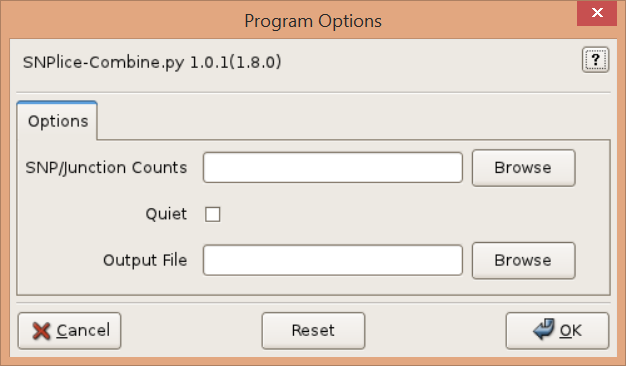

## Synopsis

### Graphical User Interface:

    SNPlice-Combine

### Command-line:

    SNPlice-Combine [options]

## Description

Sum the counts from multiple SNPlice analyses (such as from distinct samples). Each of the original analyses should have used the same set of SNPs and junctions. Statistical tests and scores are recomputed for the summed (pooled) counts. 

## Graphical User Interface

## Options

Counts, -c COUNTS, --counts=COUNTS

> Read count files computed by SNPlice (tabular output). Required. 

Quiet, -q, --quiet

>Quiet. 

Output File, -o OUTPUT, --output=OUTPUT

> Output file. Leave empty for console ouptut. Valid output formats include text (txt extension), tsv, csv, xlsx, and xls. Console output is in text format. 

--version

>show program's version number and exit. 

-h, --help

>Show this help message and exit. 

