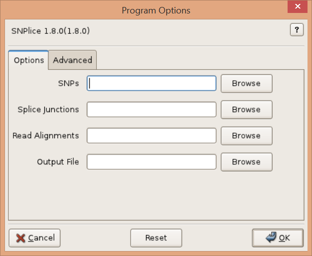
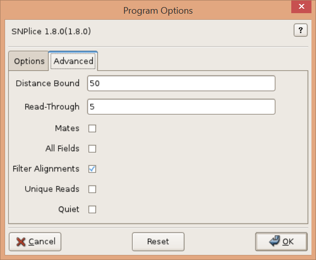

# SNPlice Usage

## Synopsis

### Graphical User Interface:

    SNPlice 

### Command-line:

    SNPlice [options]

## Description

Categorize and count transcript reads (mate-pairs) that span a SNP locus and the transition between an exon and its adjacent intron. Reads are categorized by whether they exhibit the SNP or wild-type allele and whether they are spliced, skipping the intron, or unspliced, reading into the intron. Statistical tests are applied to determine whether the SNP and intron read-through are observed together surprisingly often.

## Graphical User Interface

## Options

Read Alignments, -r ALIGNMENTS, --readalignments=ALIGNMENTS

> Read alignments in (indexed) BAM/SAM format. Required. 

SNPs, -s SNPS, --snps=SNPS

> Single-nucleotide-polymophisms (SNPs). Tabular and VCF format SNPs are supported. Tabular formats include txt, tsv, csv, xlsx, xls. Text files (txt) must have four spaced separated columns representing the chromosome (CHROM), locus (POS), wild-type allele nucleotide (REF), and SNP nucleotide (ALT). Other tabular formats must provide CHROM, POS, REF, ALT headings. Extra values in tabular or VCF format files are mapped to the output. Required. 

Splice Junctions, -j JUNCTIONS, --junctions=JUNCTIONS

>Splice junctions in BED format. Junctions are represented as two exon "blocks" separated by an intron, as output by TopHat applied to the reads. Required. 

Output File, -o OUTPUT, --output=OUTPUT

>Output file. Leave empty for console ouptut. Valid output formats include text (txt extension), tsv, csv, xlsx, and xls. Console output is in text format. 

--version

>show program's version number and exit. 

-h, --help

>Show this help message and exit. 

### Advanced

Distance Bound, -d DIST, --distance=DIST

>Upper bound on the distance between SNP locus and splice junction. Default: 100. 

Read-Through, -R READTHROUGH, --readthrough=READTHROUGH

>Minimum number of bases required on each side of the intron-exon junction. Default: 5bp. 

Mates, -M, --matepairs

>Consider read mate-pair alignments to determine splicing status. Default=False. 

All Fields, -F, --full

>Output extra diagnostic read count fields. Default=False. 

Filter Alignments, -f, --alignmentfilter

> (Turn off) alignment filtering by length, edits, etc.

Unique Reads, -U, --uniquereads

>Consider only reads with distinct sequence. 

Quiet, -q, --quiet

>Quiet. 

## See Also

[SNPlice-Combine](SNPliceCombineUsage.md), [Input Files](SNPliceInputFiles.md)

